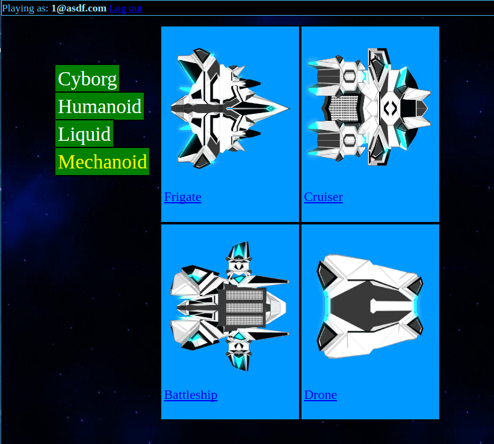
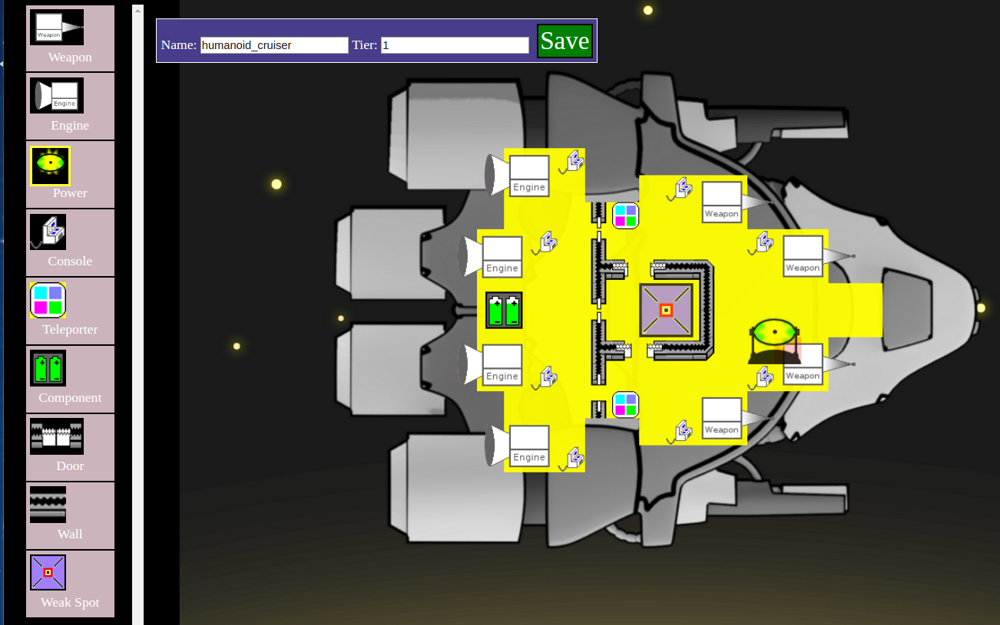
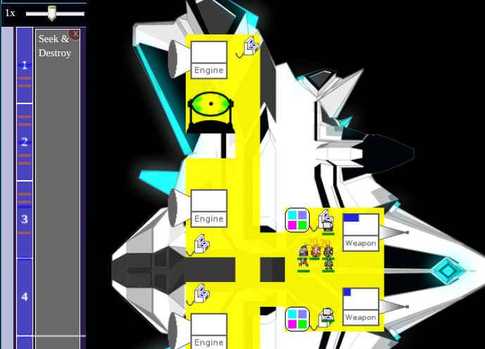
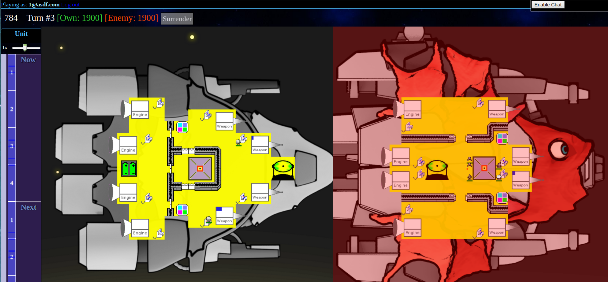

Space Runner
===========
Turn based space action game.

About this project
------------------

This project was developed by Fernando Tiberti <fertiberti@gmail.com> under contract by Tim 'mithro' Ansell <mithro@mithis.com>, the project was never completed due to a lack of funds and was thus open sourced.

Screenshots
-----------

Choosing Ship Type

Ship Builder

Melee Combat

Firing at the Enemy

How to run it
-------------

To launch the application simply type **ant run** in the command line.

The first time, this command will automatically download [PhantomJS](http://phantomjs.org/), [NodeJS](http://nodejs.org/), and [Redis](http://redis.io/) to the tools folder. Then it will start the NodeJS and Redis servers, start the app, and open [http://localhost:3000](http://localhost:3000) in your default browser.

To try the multiplayer you may open [http://localhost:3000](http://localhost:3000) in two different browsers sessions (not a different tab, but a different session like incognito mode or a different browser altogether).

Running tests
-------------

To view a report for the tests that work without the server type **ant report**. For the rest of the tests, run the app with **ant run** and open [http://localhost:3000/test.html](http://localhost:3000/test.html).

You need to have [jscoverage](http://siliconforks.com/jscoverage/) installed. To do this type:

**sudo apt-get install jscoverage**

Checking the lint
-----------------

To check the lint type **ant lint**. It will automatically download [JSLint](http://www.jslint.com/) and [Closure Linter](https://developers.google.com/closure/utilities/) to check the lint, as well as the correct headers.

##### The following are the JSLint [options](http://www.jslint.com/lint.html#options) set to true:

  * **browser**: Predefine the standard global properties that are supplied by web browsers, such as document and addEventListener.
  * **devel**: Predefine globals that are useful in development but that should be avoided in production, such as console and alert.
  * **node**: true if Node.js globals should be predefined.
  * **nomen**: true if names should not be checked for initial or trailing underbars.
  * **white**: allows for "function" and "()" to not be separated by a space.
  * **plusplus**: true if ++ and -- should be allowed.

License
-------

The code in this game is released under the [GPLv3 license](https://www.gnu.org/licenses/gpl-3.0.en.html).

The artwork is released under the [CC-BY-SA 4.0 International](https://creativecommons.org/licenses/by-sa/4.0/) license.
